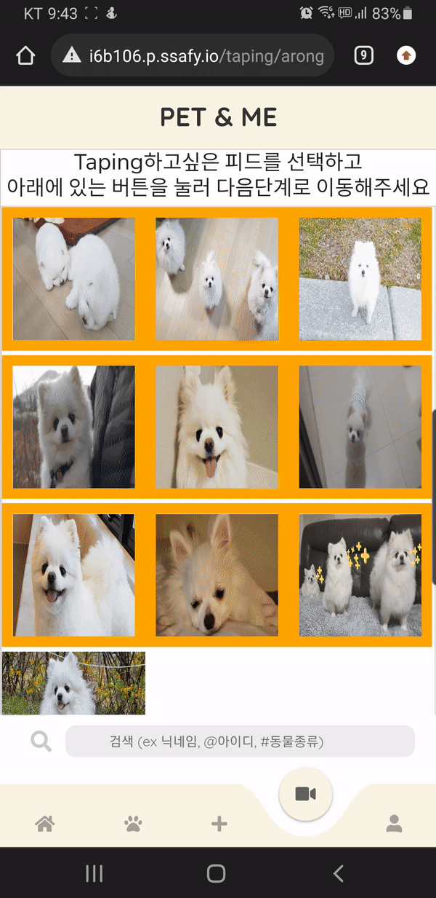
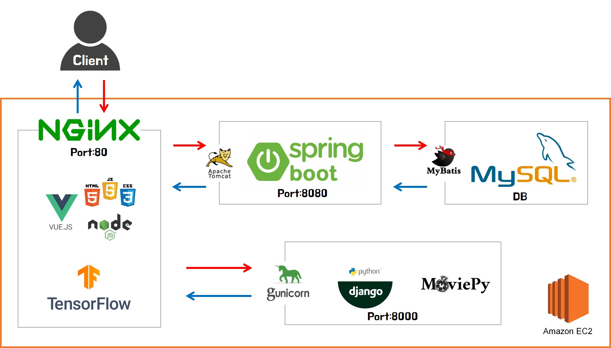
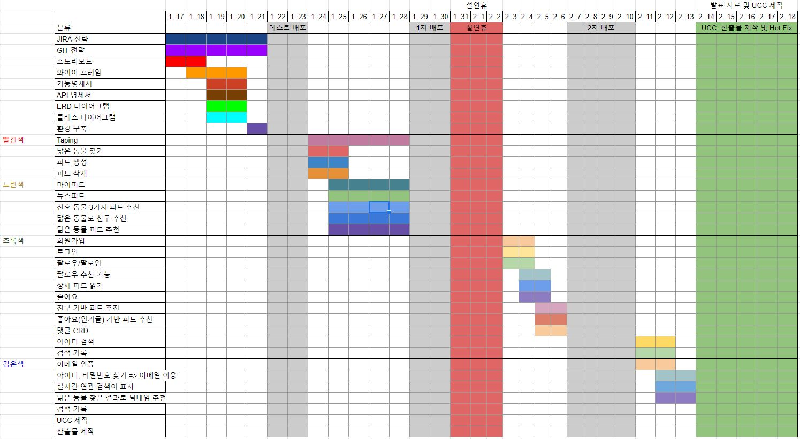

<div align="center">
    <h1>Pet & Me </h1>
    <h5>반려동물과 나의 이야기</h5>
    <p>반려동물 큐레이팅 SNS</p>
    <br/><br/><br/>
</div>


## Service Intro

Pet & Me는 자신의 반려동물과 함께한 시간을 기록하고 다른 사람과 소통하고 싶은 사용자를 대상으로 합니다. 사용자 취향 기반의 피드를 보여주고, 자신의 사진을 등록하면 닮은 동물을 찾을 수 있습니다. 그리고 이를 이용한 닉네임 추천과 관련된 반려동물과 함께하는 유저를 찾을 수 있습니다. 무엇보다 저장한 사진을 이용해 직접 영상을 커스터마이징함으로써 나만의 영상을 만들어 볼 수 있는 웹/앱 서비스입니다.


## 주요 기능

### 회원가입/로그인 기능

- 아이디, 비밀번호 입력 후 메일인증을 한다.
- 인증에 성공하면 사용자의 반려동물 유무와 정보, 선호 동물을 입력 받는다.
- 가입 후 최초 로그인 시 사용자는 닮은 동물 찾기를 통해서 닉네임을 선택한다.

### 닮은 동물 찾기


- 각 동물상으로 대표되는 연예인 사진을 이용해 Tensorflow Machine을 학습시켰으며 이를통해 사용자와 닮은 동물을 분석한다.

- 위 결과를 이용하여 3가지의 기능을 제공한다.

  a. 랜덤 닉네임을 추천하며, 사용자는 그 중 하나를 선택해 닉네임으로 변경할 수 있다.

  b. 관련된 반려동물과 함께하는 다른 유저 정보를 조회할 수 있다.

  c. 관련된 모든 동물 피드 정보를 제공한다.

### 영상 만들기(Taping)



-  사용자는 자신의 피드에 등록한 사진들을 기반으로 영상을 만들 수 있다.
-  사진 선택 후 원하는 영상 스타일과 배경 음악을 선택하여 영상이 제작된다.

### SNS 기능


- 뉴스피드 페이지는 선호 동물과 팔로워 피드를 기반으로 최신 순으로 제공한다.


- 마이 피드 페이지는 프로필 사진, 닉네임, 사용자 아이디, 반려동물 정보(이름, 종, 성별, 나이), 소개말을 표시한다.
- 현재 사용자의 팔로워, 팔로잉 리스트를 확인하고, 팔로우/언팔로우를 할 수 있다.
- 내 피드에서 글 작성/삭제가 가능하고, 피드 상세에서 댓글 등록/삭제 및 다른 유저가 남긴 댓글을 확인할 수 있다.

### 검색 기능

- 검색창에서 키워드를 통해 유저를 검색할 수 있다.
- 유저아이디, 유저닉네임, 동물종류 3가지 검색방법이 있다.


## 시스템 구조




## 프로젝트 일정




## Install and Usage

### Download

```bash
git clone https://lab.ssafy.com/s06-webmobile2-sub2/S06P12B106.git
```

### Frontend

```bash
cd frontend/pet-and-me
npm install
npm run serve
```

### Backend

**자바 서버**

- Java (Open JDK 11)를 설치
- MySQL 8.0.28 설치 및 dump.sql 실행

```bash
cd backend/pet
./gradlew clean build
cd build/libs
java -jar pet-0.0.1-SNAPSHOT.jar
```

**장고 서버**

- Python 3 설치
- Django 3.2.9 설치

```bash
cd tapingDjango
pip install -r requirements.txt
python manage.py migrate
python manage.py runserver
```


## 역할 분담

| 팀원   | 역할            | email                |
| ------ | --------------- | -------------------- |
| 이주형 | 팀장 (Backend)  | ssrcus27@naver.com   |
| 김나린 | 팀원 (Backend)  | knl_1219@hanmail.net |
| 김정윤 | 팀원 (Backend)  | kimjy199@naver.com   |
| 신동호 | 팀원 (Frontend) | sdh98429@gmail.com   |
| 이진석 | 팀원 (Frontend) | amateur@kakao.com    |
| 장지빈 | 팀원 (Frontend) | thekey1017@gmail.com |

